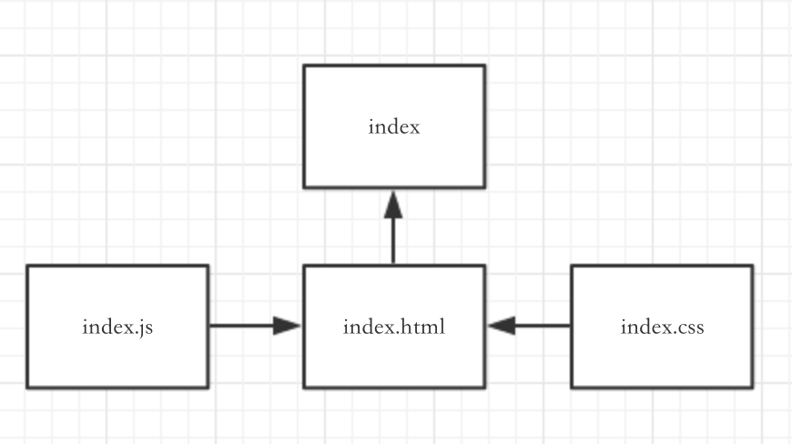
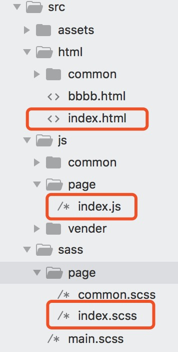
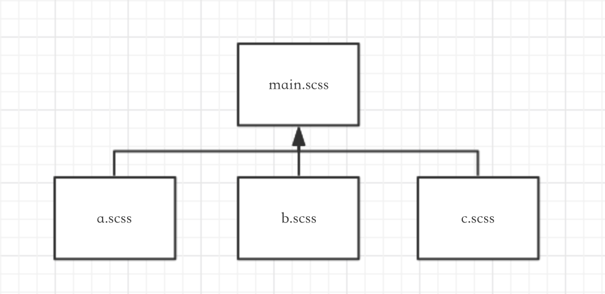

# web-mobile-cli简易教程
[web-mobile-cli](https://github.com/sihai00/web-mobile-cli)：可快速开发移动端h5的脚手架

## 一：脚手架使用
``` bash
# 全局安装
npm install web-mobile-cli -g

# 创建项目目录(name为项目名字)
web-mobile-cli -n name

# 进入项目，运行前请先安装所需依赖
npm install

# 运行以下命令启动服务器 localhost:3000
npm start

也可以指定启动服务器的端口
npm start -- -p 3001

# 打包（dist文件）
npm run build
```

> **注意**：运行npm start后如果白屏或者出错，请手动刷新一次，导致的原因可能是browser-sync启动浏览器的时候还没有打包完成

## 二：一个页面构成
一个传统的页面的构成 = html + js + css


所以web-mobile-cli的目录结构为（假如以name为页面名字），都一一对应
- html：html/name.html
- css：sass/page/name.scss
- javascript：js/page/name.js



### 2-1：html
由于集合了[gulp-file-include](https://github.com/coderhaoxin/gulp-file-include)，可将公共的静态html抽离出来重复调用，可根据实际情况决定是否使用，如下简单用法

```html
<!-- a.html -->
<div>a.html</div>
```

```html
<!-- b.html -->
<div>b.html</div>
@@include('./a.html')
```

```html
<!-- 最终渲染 -->
<div>a.html</div>
<div>b.html</div>
```

由于在b.html页面中调用了@@include('./a.html')，所以最终会将a.html的代码片段渲染在b.html中，a.html的代码片段可重复调用，更多用法查看[gulp-file-include](https://github.com/coderhaoxin/gulp-file-include)

### 2-2：sass
main.scss为主入口，在此可定义全局css，通过sass语法@import将其他子页面的sass引入。那么打包后只生成一个main.css文件，减少请求



```scss
/**
 * 适配布局，px转vw
 * h1 {
 *   witdh: pxToVw(20)
 * }
 */
$baseFontSize: 7.5;
@function pxToVw($px) {
  @return $px / $baseFontSize * 1vw;
}

/* 全局样式 */
html, body{
  font-family: "Microsoft YaHei";
  height: 100%;
  margin: 0;
  padding: 0;
}
ul, ol{
  list-style: none;
  margin: 0;
  padding: 0;
}
h1,h2,h3,h4,h5{
  margin: 0;
}

/* 公共组件样式 */
@import "./page/common.scss";

/* 子页面样式 */
@import "./page/index.scss";
```

### 2-3：javascript
面向对象的编程，每个子页面的js都继承至parent类，那么子页面的js可以调用父类parent里的属性和方法（es6语法，如果不熟请自行学习[阮一峰es6](http://es6.ruanyifeng.com/#docs/class)）


```javascript
// parent.js
class parent{
  ...
}

// index.js
class index extends parent{
  ...
}
```

## 三：demo上手
1. TodoList
2. 网络请求

### 3-1：TodoList
编写TodoList

#### 3-1-1：创建TodoList.html
1. 在```src/html```下创建**TodoList.html**
2. 创建一个id为js-TodoList的div，用来存放TodoList的列表
3. script引用TodoList.js（其中rev=@@hash会自动生成一段随机数，用来解决浏览器缓存问题）

> 其中```@@include("common/header.html")```是引用了```src/html/common```下的header.html文件，作用是把公共的提取出来可以统一更改。```@@include("common/header.html")```同理

```html
<!DOCTYPE html>
<html lang="en">
@@include("common/header.html")
<body>
  <!-- page -->
  <div class="TodoList-page" id="js-TodoList"></div>

</body>
@@include("common/script.html")
<script src="js/page/TodoList.js?rev=@@hash" defer></script>
</html>
```

#### 3-1-2：创建TodoList.scss

1. 在```src/sass/page```中创建TodoList.scss
```scss
.TodoList-page{
  >div{
    margin: pxToVw(20);
    background-color: #999;
  }
  .active{
    text-decoration: line-through;
    color: yellow;
  }
}
```

2. 在```src/sass/main.scss```中导入TodoList.scss文件

> 在项目中会统一把所有scss文件打包成一个main.css文件，所以不需要在html中单独引入，只需要在main.scss中import其他scss文件即可

```scss
/**
 * 适配布局，px转vw
 * h1 {
 *   witdh: pxToVw(20)
 * }
 */
$baseFontSize: 7.5;
@function pxToVw($px) {
  @return $px / $baseFontSize * 1vw;
}

/* 全局样式 */
html, body{
  font-family: "Microsoft YaHei";
  height: 100%;
  margin: 0;
  padding: 0;
}
ul, ol{
  list-style: none;
  margin: 0;
  padding: 0;
}
h1,h2,h3,h4,h5{
  margin: 0;
}

@import "./page/common.scss";
@import "./page/index.scss";
@import "./page/TodoList.scss";
```

#### 3-1-3：创建TodoList.js
1. 在```src/js/page```中创建TodoList.js
2. 在```this.state```中定义$list和arr。（把当前页面需要用到的状态或数据等保存在```this.state```中，以便调用）
  - $list获取上述html中的id为js-TodoList的dom元素
  - arr为渲染dom节点

> ```document.addEventListener('DOMContentLoaded', function(){ ... })```的作用是HTML文档被完全加载和解析完成之后，DOMContentLoaded 事件被触发（此时图片等资源文件并未加载），在这时触发js是最快的

```javascript
document.addEventListener('DOMContentLoaded', function(){
  class TodoList extends parent{
    constructor(){
      super()
      
      this.state = {
        $list: $('#js-TodoList'),
        arr: [
          {
            todo: false,
            title: '1111'
          },
          {
            todo: false,
            title: '2222'
          }
        ]
      }
    }
  }

  new TodoList()
})

```

3. ```this.init```是初始化函数，它包含两个生命周期load和ready
  - load用于请求数据，渲染数据。所以在load函数的render函数用来把数据（this.state.arr）渲染成dom元素
  - ready用于添加dom的事件，例如点击事件等等

> 必须先渲染完dom元素后才能添加添加事件，所以使用es7的async方法，先让load函数执行完后再执行ready函数

```javascript
document.addEventListener('DOMContentLoaded', function(){
  class TodoList extends parent{
    constructor(){
      super()
      
      this.state = {
        $list: $('#js-TodoList'),
        arr: [
          {
            id: 1,
            todo: false,
            title: '1111'
          },
          {
            id: 2,
            todo: false,
            title: '2222'
          }
        ]
      }

      // 初始化
      this.init()
    }
    async init(){
      // 加载前 - 用于请求数据
      await this.load()

      // 加载后 - 用于绑定事件
      this.ready()
    }
    async load(){
      this.render(this.state.arr)
    }
    ready(){
      
    }
  }

  new TodoList()
})
```

4. render函数的渲染使用了createDocumentFragment文档片段，利于性能优化
```javascript
document.addEventListener('DOMContentLoaded', function(){
  class TodoList extends parent{
    constructor(){
      super()
      
      this.state = {
        $list: $('#js-TodoList'),
        arr: [
          {
            id: 1,
            todo: false,
            title: '1111'
          },
          {
            id: 2,
            todo: false,
            title: '2222'
          }
        ]
      }

      // 初始化
      this.init()
    }
    async init(){
      // 加载前 - 用于请求数据
      await this.load()

      // 加载后 - 用于绑定事件
      this.ready()
    }
    async load(){
      this.render(this.state.arr)
    }
    ready(){
      
    }
    createListFragment(arr){
      let fragment = document.createDocumentFragment()
      arr.forEach((v) => {
        let html = `
          <div class="${v.todo ? 'active' : ''}" data-id=${v.id}>${v.title}</div>
        `
        fragment.appendChild($(html)[0])
      })

      return fragment
    }
    render(arr){
      // 创建文档片段
      let fragment = this.createListFragment(arr)
      // 把文档片段添加到$list中
      this.state.$list.empty().append(fragment)
    }
  }

  new TodoList()
})
```

5. 在ready中添加用户对$List的点击事件的处理
```javascript
document.addEventListener('DOMContentLoaded', function(){
  class TodoList extends parent{
    constructor(){
      super()
      
      this.state = {
        $list: $('#js-TodoList'),
        arr: [
          {
            id: 1,
            todo: false,
            title: '1111'
          },
          {
            id: 2,
            todo: false,
            title: '2222'
          }
        ]
      }

      // 初始化
      this.init()
    }
    async init(){
      // 加载前 - 用于请求数据
      await this.load()

      // 加载后 - 用于绑定事件
      this.ready()
    }
    async load(){
      this.render(this.state.arr)
    }
    ready(){
      // 事件委托
      this.state.$list.tap((e) => {
        // 目标dom元素
        const target = e.target
        // 目标dom元素的id
        const id = e.target.dataset.id
        
        // 根据点击目标dom元素来修改this.state.arr中相对应元素的todo值
        this.state.arr = this.state.arr.map(v => {
          let val = v
          if (`${v.id}` === id) val = Object.assign({}, v, { todo: !v.todo })
          return val
        })
        
        // 再次渲染this.state.arr
        this.render(this.state.arr)
      })
    }
    createListFragment(arr){
      let fragment = document.createDocumentFragment()
      arr.forEach((v) => {
        let html = `
          <div class="${v.todo ? 'active' : ''}" data-id=${v.id}>${v.title}</div>
        `
        fragment.appendChild($(html)[0])
      })

      return fragment
    }
    render(arr){
      let fragment = this.createListFragment(arr)
      this.state.$list.empty().append(fragment)
    }
  }

  new TodoList()
})
```

### 3-2：网络请求
网络请求无非是数据的来源不同而已，所以只需要把请求回来的数据替换成this.state.arr中即可，我们使用cndoe社区开放的api

> **注意**：this.fetch是parent类的方法，如果当前方法没有定义this.fetch，那么就从原形链上找，由于parent类中定义了this.fetch，就找到了。this.state中定义的是当前页面所使用的变量，而this中可以使用父类所定义的变量和方法

```javascript
document.addEventListener('DOMContentLoaded', function(){
  class TodoList extends parent{
    constructor(){
      super()
      
      this.state = {
        $list: $('#js-TodoList'),
        arr: [
          {
            id: 1,
            todo: false,
            title: '1111'
          },
          {
            id: 2,
            todo: false,
            title: '2222'
          }
        ]
      }

      // 初始化
      this.init()
    }
    async init(){
      // 加载前 - 用于请求数据
      await this.load()

      // 加载后 - 用于绑定事件
      this.ready()
    }
    async load(){
      // 请求cnode数据
      const data = await this.fetchData()
      
      // 初始化数据，添加todo属性
      this.state.arr = data.data.map(v => Object.assign({}, v, {todo: false}))
      this.render(this.state.arr)
    }
    ready(){
      this.state.$list.tap((e) => {
        const target = e.target
        const id = e.target.dataset.id

        this.state.arr = this.state.arr.map(v => {
          let val = v
          if (v.id === id) val = Object.assign({}, v, { todo: !v.todo })
          return val
        })

        this.render(this.state.arr)
      })
    }
    fetchData(){
      return this.fetch({
        method: 'get',
        url: `${this.baseUriApi}/topics`,
        params: {
          limit: 10
        }
      })
    }
    createListFragment(arr){
      let fragment = document.createDocumentFragment()
      arr.forEach((v) => {
        let html = `
          <div class="${v.todo ? 'active' : ''}" data-id=${v.id}>${v.title}</div>
        `
        fragment.appendChild($(html)[0])
      })

      return fragment
    }
    render(arr){
      let fragment = this.createListFragment(arr)
      this.state.$list.empty().append(fragment)
    }
  }

  new TodoList()
})

```

## 四：总结
其实当你理清了目录结构和生命周期后，使用起来还是比较方便的，在脚手架中es7和sass是可以不使用的根据具体情况而定，使用该脚手架需要具备一定的前端基础知识～当然脚手架可能存在一些问题，例如脚手架对于第三方是直接引入压缩的文件，这点并不方便，在改进，互勉啦～～～
