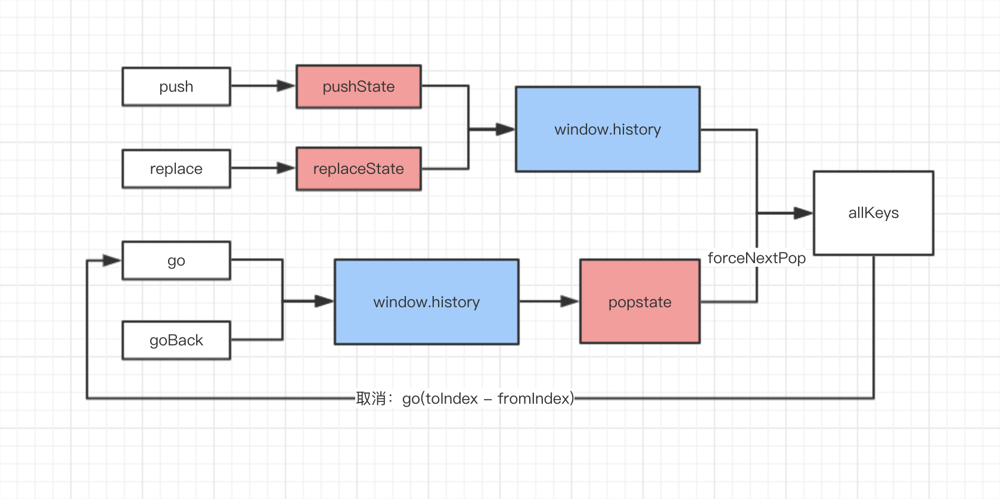

# 手把手带你上react-router的history车
接上一篇[history源码解析-管理会话历史记录](https://juejin.im/post/5c049f23e51d455b5a4368bd)，本篇教你手写`history`，重在理解其原理。

> `history`是一个JavaScript库，可让你在JavaScript运行的任何地方轻松管理会话历史记录

## 1.前言
`history`是由Facebook维护的，`react-router`依赖于`history`，区别于浏览器的`window.history`，`history`是包含`window.history`的，让开发者可以在任何环境都能使用`history`的api（例如`Node`、`React Native`等）。本文中`history`指仓库的对象，`window.history`指浏览器的对象。

本篇读后感分为五部分，分别为前言、使用、原理、上手、总结，推荐顺序阅读哈哈。

**附上地址** 
1. [history](https://github.com/ReactTraining/history)
2. [history解析的Github地址](https://github.com/sihai00/blog/tree/master/analysis/history)
3. [history demo的Github地址](https://github.com/sihai00/blog/tree/master/analysis/history/demo)
4. [history源码解析-管理会话历史记录（掘金）](https://juejin.im/post/5c049f23e51d455b5a4368bd)

## 2.使用
```html
<!DOCTYPE html>
<html>
  <head>
    <script src="history.js"></script>
    <script>
      var createHistory = History.createBrowserHistory

      var page = 0
      // createHistory创建所需要的history对象
      var h = createHistory()

      // h.block触发在地址栏改变之前，用于告知用户地址栏即将改变
      h.block(function (location, action) {
        return 'Are you sure you want to go to ' + location.path + '?'
      })

      // h.listen监听当前地址栏的改变
      h.listen(function (location) {
        console.log(location, 'lis-1')
      })
    </script>
  </head>
  <body>
    <p>Use the two buttons below to test normal transitions.</p>
    <p>
      <!-- h.push用于跳转 -->
      <button onclick="page++; h.push('/' + page, { page: page })">history.push</button>
      <button onclick="h.goBack()">history.goBack</button>
    </p>
  </body>
</html>
```
`history`用法：
1. `block`用于地址改变之前的截取；
2. `listener`用于监听地址栏的改变；
3. `push`添加新历史记录；
4. `replace`替换当前历史记录；
5. `go(n)`跳转到某条历史记录；
6. `goBack`返回上一条历史记录。

## 3.原理


解释：
1. `push`、`replace`、`go`、`goBack`：仓库`history`的方法
2. `pushState`、`replaceState`：`window.history`的方法，用于修改`window.history`历史记录
3. `popstate`：监听历史记录的改变`window.addEventListener('popstate', callback)`
4. `forceNextPop`：自定义变量，用于判断是否跳过弹出框
5. `allKeys`：自定义变量，它跟历史记录是同步的。每当修改历史记录，都会维护这个数组，用于当弹出框点击取消时，可以返回到上次历史记录
6. `go(toIndex - fromIndex)`：弹出框取消时，返回上一次历史记录

> 当活动历史记录条目更改时，将触发popstate事件。需要注意的是调用history.pushState()或history.replaceState()不会触发popstate事件。只有在做出浏览器动作时，才会触发该事件，如用户点击浏览器的回退按钮（或者在Javascript代码中调用history.back()）

**路线1（`push`和`replace`）**：
1. 用户调用`push`；
2. 弹出弹出框；
    1. 点确定按钮：
        1. 调用`window.history.pushState`添加历史记录，把`key`存储到`window.history`中（注意这个时候不会触发`popstate`监听函数）；
        2. 地址改变；
        3. 维护自定义变量`allKeys`，添加`key`到`allKeys`数组。
    2. 点取消按钮：不操作。

**线路2（`go`和`goBack`）**：
1. 用户调用`go`；
2. 修改历史记录`window.history`，地址改变；
4. 触发`popstate`历史记录监听函数（如果绑定了`popstate`监听函数）；
5. 弹出弹出框；
    1. 点确定按钮：
        1. 更新`history`（保证`history`是最新的信息，例如`history.location`是当前地址信息）。
    2. 点取消按钮（因为在第二步的时候地址已经跳转了，点弹出框的取消意图就需要回到之前的记录）：
        1. 计算`toIndex`：跳转前的地址（取`history.location`的值，因为此时的`history.location`尚未更新是旧值）；
        2. 计算`fromIndex`：当前地址的`key`；
        3. 计算两者的差值，调用`go`方法跳回去上次历史记录。

这基本是`history`的原理了，应该会有些同学存在疑惑，调用弹出框这个可以放在调用`go`之前，同样能达到效果，而且代码会更加简洁且不需要维护`allKeys`这个数组。我之前也有这个疑问，但仔细想想，`go`函数并不包含所有历史记录改变的操作，如果用户左滑动返回上一个页面呢，那样就达不到效果了。所以必须在监听历史记录改变后，才能触发弹出框，当点击弹出框的取消按钮后，只能采用维护`allKeys`数组的方式来返回上一页。

## 4.demo
代码都有注释，100多行代码模仿`history`写了个简易阉割版，目的是为了了解`history`的原理，应该很容易就看懂的。

```javascript
(function(w){
  let History = {
    createBrowserHistory
  }

  function createBrowserHistory(){
    // key
    function createKey() {
      return Math.random().toString(36).substr(2, 6);
    }

    // 获取地址信息
    function getDOMLocation(historyState = {}) {
      const { key, state } = historyState || {};
      const { pathname, search, hash } = window.location;

      return {pathname, search, hash, key};
    }
    // location地址信息
    let initialLocation = getDOMLocation()

    // 初始化allKeys
    let allKeys = [initialLocation.key]

    // listen数组
    let listener = []
    // 监听
    function listen(fn){
      listener.push(fn)

      checkDOMListeners()
    }

    // 只能添加一个监听历史条目改变的函数
    let isListener = false
    function checkDOMListeners(){
      if (!isListener) {
        isListener = true
        window.addEventListener('popstate', handlePop)
      }
    }

    // 跳过block。因为当点击弹出框的取消后，会执行go，然后会再一次执行handlePop函数，此次要跳过
    let forceNextPop = false
    // 监听历史条目改变
    function handlePop(event){
      let location = getDOMLocation(event.state)
      if (forceNextPop) {
        forceNextPop = false
      } else {
        // 弹出框
        let isComfirm = prompt && window.confirm(prompt(window.location)) && true

        if (isComfirm) {
          // 确定
          // 更新history
          Object.assign(history, {location, length: history.length})
        } else {
          // 取消
          // 获取当前的history.key和上一次的location.key比较，然后进行回跳
          let toIndex = allKeys.indexOf(history.location.key)
          toIndex = toIndex === -1 ? 0 : toIndex

          let fromIndex = allKeys.indexOf(location.key)
          fromIndex = fromIndex === -1 ? 0 : fromIndex

          // 差值
          let delta = toIndex - fromIndex

          // 差值为0不跳
          if (delta) {
            forceNextPop = true;
            go(delta);
          }
        }
      }
    }

    // 截取函数
    let prompt = null
    function block(fn){
      prompt = fn
    }

    // push
    function push(href){
      let isComfirm = prompt && window.confirm(prompt(window.location)) && true

      if (isComfirm) {
        let key = createKey()
        // 更新allKeys数组
        allKeys.push(key)
        // 更新历史条目
        w.history.pushState({key}, null, href)
        
        // 获取当前最新的location信息
        let location = getDOMLocation({key})

        // 更新history
        Object.assign(history, {location, length: history.length})
      }
    }

    // go
    function go(n){
      w.history.go(n)
    }

    // goBack
    function goBack(){
      go(-1);
    }

    let history = {
      length: w.history.length,
      listen,
      block,
      push,
      go,
      goBack,
      location: initialLocation
    }
    return history
  }

  w.History = History
})(window)
```

## 5.总结
学代码必须手写，学英语必须开口，学习必须主动！
