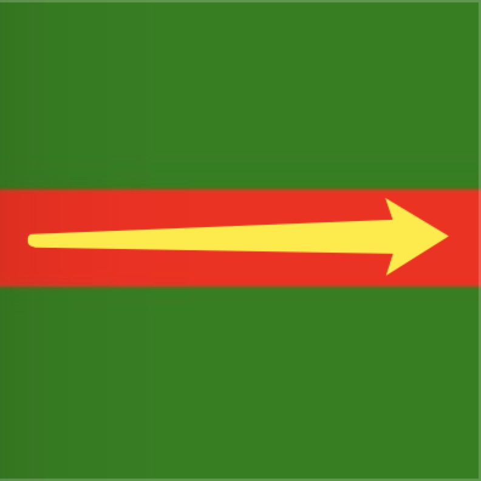

效果如其名，想必都见过下雪（可能南方人除外哈哈），但下雪效果只是一类效果的名称，可以是红包雨等一些自由落体的运动效果，本文就是用纯`css`模拟下雪的效果。


## 1.前言
由于公司产品的活动，需要模拟类似下雪的效果。浏览器实现动画无非`css3`和`canvas`（还有`gif`），对比下`css3`和`canvas`的优缺点：
1. 动画自由度：`canvas`胜；
2. 复杂度：`canvas`胜；
3. 兼容性：`canvas`胜；
4. 性能：`css3`胜（`requestAnimationFrame`和硬件加速）。

由于流量较大对于性能有一定的要求，`canvas`对比`css3`会有更多的计算量导致性能可能不太好，所以选用`css3`模拟下雪效果（ps：能用`css`解决的问题就不用`javascript`解决哈哈）。

**附上地址** 
* [下雪效果Github代码](https://github.com/sihai00/blog/tree/master/fallSnow)
* [下雪效果codepen](https://codepen.io/sihai00/pen/EGqpXp)

## 2.原理
本文所采用的是`css3`的`animation`。为`dom`元素添加`animation`属性就可以模拟动画，例如w3school的例子：
```html
<!DOCTYPE html>
<html lang="en">
<head>
  <meta charset="UTF-8">
  <meta name="viewport" content="width=device-width, initial-scale=1.0">
  <meta http-equiv="X-UA-Compatible" content="ie=edge">
  <title>animation</title>
  <style>
    .animation{
      width:100px;
      height:100px;
      background:red;
      position:relative;
      animation:mymove 5s infinite;
      -webkit-animation:mymove 5s infinite;
    }
    @keyframes mymove{
      from {
        left:0px;
      }
      to {
        left:200px;
      }
    }
  </style>
</head>
<body>
  <div class="animation"></div>
</body>
</html>
```
当然这谁都会，但有个问题是，下雪并不是机械的下落，而是有快有慢、摆动幅度、时间不定，这里的重点是需要构造随机性，理性分析下。
1. 在浏览器中下雪的起始点随机;
2. 下雪的速度随机;
3. 下雪从开始到落到地面的时间随机（延时随机和整个下雪过程的时间随机）;
4. 下雪过程中摇摆随机。

我们可以在css中找到这几点随机性的对应属性：
1. 起始点：`position`的左右方位（动画我们一般采用定位，因为可以减少不必要的重排和重绘）；
2. 速度：`animation-timing-function`（提供了丰富的速度属性）；
3. 时间：`animation-duration`和`animation-delay`；
4. 摇摆：`transform: translateX()`（在水平方向上的位移）。

可能有人会问，这几个属性并不是随机的呀，并不像`Math.random`随机函数那样。我们换个思考方向，本文所说的随机是随机雪，并不是随机雪的属性。每个雪的下落时间、下落速度、摆动幅度是固定的，雪与雪之间的下落时间、下落速度、摆动幅度是不同，那么就达到效果了。

意识到这点，就剩下最后一个问题，怎样给每个雪不同的下落时间、下落速度、摆动幅度呢？这里我们使用真正的随机函数`Math.random`，利用data自定义属性配合`Math.random`和css的属性匹配规则，就可以确定动画效果了。
## 3.构造雪形状
### 3.1 一条线性渐变

```css
.linear{
  width: 100px;
  height: 100px;
  background: linear-gradient(0, green 40%, red 40%, red 60%, green 60%);
}
```
### 3.2 多条线性渐变画雪花

```css
.linear{
  width: 100px;
  height: 100px;
  background-image: linear-gradient(0, rgba(255,255,255,0) 40%, #fff 40%, #fff 60%, rgba(255,255,255,0) 60%),
    linear-gradient(45deg, rgba(255,255,255,0) 43%, #fff 43%, #fff 57%, rgba(255,255,255,0) 57%),
    linear-gradient(90deg, rgba(255,255,255,0) 40%, #fff 40%, #fff 60%, rgba(255,255,255,0) 60%),
    linear-gradient(135deg, rgba(255,255,255,0) 43%, #fff 43%, #fff 57%, rgba(255,255,255,0) 57%);
}
```
## 4.构造下雪动画
我用`sass`写的`css`来构造动画，其实语言无所谓，重在原理。
### 4.1 起始点
```scss
@for $i from 1 through 100 {
  .animation[data-animation-position='#{$i}'] {
    left: #{$i}vw;
  }
}
```
这里运用`sass`的循环函数来创造1到100的匹配`class`名为`animation`和属性选择器为`[data-animation-position=1~100vw]`的值，例如我们想要元素的`left`为`50vw`，就直接添加`class`名`data-animation-position=50vw`。这里有两点需要说明：
1. 范围1~100`vw`：注意单位是`vw`，我们想要雪花的起始点出现在水平方向的任意位置，而`vw`是把屏幕等分为`100`份，`100vw`就是满屏；
2. 为什么要把1～100都循环出来：只有这样才能匹配到范围内我们需要的值。

### 4.2 速度
```scss
$timing: (
  linear: linear,
  ease: ease,
  ease-in: ease-in,
  ease-out: ease-out,
  ease-in-out: ease-in-out
);

@each $key, $value in $timing {
  .animation[data-animation-timing='#{$key}'] {
    transition-timing-function: $value;
  }
}
```

### 4.3 时间
时间包含动画运动时间和延时时间。
```scss
@for $i from 1 through 4 {
  .animation[data-animation-delay='#{$i}'] {
    animation-delay: #{$i}s;
  }
}
@for $i from 4 through 8 {
  .animation[data-animation-duration='#{$i}'] {
    animation-duration: #{$i}s;
  }
}
```

### 4.4 摇摆
下雪由两个动画组成，分别是下落`fall`和摇摆`swing`，下落的动画是固定的，只有摇摆需要随机，所以我自定义了属性匹配规则，就可以随机摇摆了。
```scss
@for $i from 1 through 4 {
  .animation[data-animation-name='#{$i}'] {
    animation-name: fall, swing#{$i};
  }
}
@for $i from 1 through 4 {
  @keyframes swing#{$i}{
    25% {
      transform: translateX(-#{$i * 10}px);
    }
    50% {
      transform: translateX(#{$i * 10}px);
    }
    75%{
      transform: translateX(-#{$i * 10}px);
    }
    100%{
      transform: translateX(#{$i * 10}px);
    }
  }
}
```

## 5.随机性
这里用`react`来演示代码，还是那句话只要理解了原理，语言其实并不太重要。

### 5.1 雪花元素
```javascript
<div className='page'>
  {
    Array(10).fill().map((v, i) => (
      <span
        key={i}
        className='animation span'
        data-animation-position={this.position()}
        data-animation-timing={this.timing()}
        data-animation-delay={this.delay()}
        data-animation-duration={this.duration()}
        data-animation-name={this.name()}
      />
    ))
  }
</div>
```
我们的雪花元素包含几下几个属性值：
1. `data-animation-position`：起始位；
3. `data-animation-timing`：下雪速度；
2. `data-animation-delay`：延时；
4. `data-animation-duration`：下雪总时间；
5. `data-animation-name`：下落动画和摇摆动画。

### 5.1 随机范围函数
```javascript
random(min, max){
  return Math.floor(Math.random() * (max - min + 1) + min)
}
```

### 5.2 属性随机赋值
```javascript
position(){
  return this.random(1, 100)
}
delay(){
  return this.random(1, 4)
}
duration(){
  return this.random(4, 8)
}
name(){
  return this.random(1, 4)
}
timing(){
  return ['linear', 'ease', 'ease-in', 'ease-out', 'ease-in-out'][this.random(0, 4)]
}
```

## 6.总结
> 张鑫旭的鑫三无准则：无宽度、无图片和无浮动。

我个人觉得如果非要加上第四无，可以是 **无`js`** 哈哈（开玩笑）。随着`css`的发展，其领域可谓很广很深并且也不可或缺，很多时候如果`css`运用的比较好的话，会节省很多时间和`js`代码的，整个功能实现的难度都会下降，互勉互勉。