# mongo聚合笔记
> `MongoDB` 是一个基于分布式文件存储的数据库。由 `C++` 语言编写。旨在为 `WEB` 应用提供可扩展的高性能数据存储解决方案。

## 1.前言
自从前后端分离后就一直有争辩，前后端分离的界限在哪里，前端仅仅是写页面吗？需要学习服务器数据库等后端的知识吗？

我认为是非常有必要的，假如就笼统以浏览器和服务器区分前后端，如何解释浏览器的 `indexedDB` 的存在。存在就是合理的，了解越多可以走得越远。

公司最近有 `mongo` 聚合的需求，我瞬间有了极大的兴趣，这篇文章是 `mongo` 的学习和解决问题笔记。

## 2.环境
环境安装与本篇文章的关系不大，但提供几个渠道：
1. 跟着 `mongo` 官方文档来安装，本地启动调试；
2. `mongo` 客户端，[Robo 3T](https://robomongo.org/)很好用哦；
3. `mongo` 官方的[命令行小窗口](https://docs.mongodb.com/manual/tutorial/insert-documents/)（***免安装直接使用，学习推荐***）。

## 3.介绍
在城市中有几所学校（`db`），我们来查看下城市中的学校都有哪些
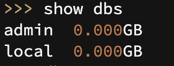

然后需要指定学校，作用是可以操作该学校（`mongo`默认指向`test`）
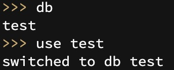

## 4.插入
学校（`test`）到了期末考试，成绩如下：

| 姓名 | 性别 | 语文 | 数学 | 英语 | 参加考试时间 |
|:---:|:---:|:---:|:---:|:---:|:---:|
| 小一 | 男生 | 90 | 90 | 90 | 2019年6月10号 |
| 小二 | 女生 | 80 | 80 | 80 | 2019年6月10号 |
| 小三 | 女生 | 70 | 70 | 70 | 2019年6月10号 |
| 小四 | 女生 | 60 | 60 | 60 | 2019年6月12号 |

成绩出来后老师把分数录入成绩系统。
```javascript
// 插入的方法：insertOne插入一条数据
db.student.insertOne({ 
  name: "小一", 
  sex: '男生', 
  chinese: '90', 
  math: '90', 
  english: '90', 
  createdAt: new Date('2016-06-09T16:00:00Z')
})
```
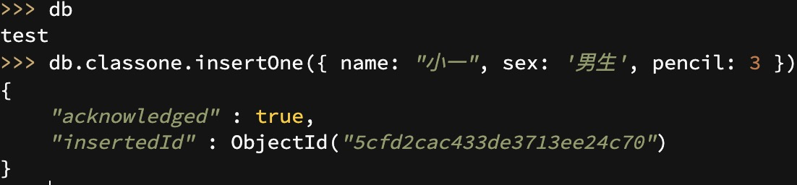

> 注意：`new Date('2016-06-09T16:00:00Z')`是世界标准时间，`mongo`记录的也是世界标准时间。中国在东八区，时间加8小时，换算过来刚好是2019年6月10号。

老师觉得一个个添加太烦了，所以一次性添加：
```javascript
// // 插入的方法：insertMany 插入一条数据
db.student.insertMany([
  { name: "小二", sex: '女生', chinese: '80', math: '80', english: '80', createdAt: new Date('2016-06-09T16:00:00Z')},
  { name: "小三", sex: '女生', chinese: '70', math: '70', english: '70', createdAt: new Date('2016-06-09T16:00:00Z')},
  { name: "小四", sex: '女生', chinese: '60', math: '60', english: '60', createdAt: new Date('2016-06-11T16:00:00Z')}
])
```
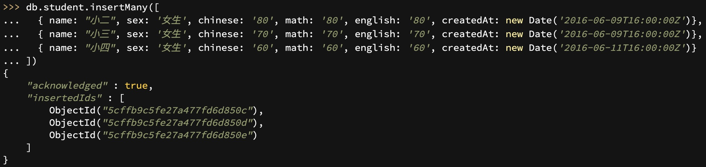

> 1. 学校（`db`）：数据库，`mongo`可以容纳多个数据库，默认使用`test`；
> 2. 学生集合（`student`）：集合，可以理解为集合所有学生的班级；
> 3. 学生信息（`data`）：文档，可以理解为单个学生信息。

## 5.修改
老师突然发现，小三其实是女装大佬，老师被骗恼羞成怒，于是修改其性别。
```javascript
// 更新方法：updateOne
db.student.updateOne(
  { name: '小三' },
  { $set: { sex: '女装大佬' }}
)
```
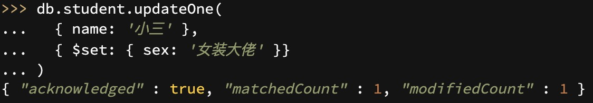

> 其中 `$set` 是更新操作符，告诉 `mongo` 需要对符合的数据进行什么操作。用法差不多，列举部分如下（更多[更新操作符](https://docs.mongodb.com/manual/reference/operator/update/)）：
> 1. [$currentDate](https://docs.mongodb.com/manual/reference/operator/update/currentDate/#up._S_currentDate)：设置时间；
> 2. [$inc](https://docs.mongodb.com/manual/reference/operator/update/inc/#up._S_inc)：按指定的数量增加字段的值；
> 3. [$min](https://docs.mongodb.com/manual/reference/operator/update/currentDate/#up._S_currentDate)：仅当指定的值小于现有字段值时才更新字段；
> 4. [$max](https://docs.mongodb.com/manual/reference/operator/update/currentDate/#up._S_currentDate)：仅当指定的值大于现有字段值时才更新字段；
> 5. [$mul](https://docs.mongodb.com/manual/reference/operator/update/currentDate/#up._S_currentDate)：将字段的值乘以指定的量；
> 6. [$rename](https://docs.mongodb.com/manual/reference/operator/update/currentDate/#up._S_currentDate)：重命名字段；
> 7. [$set](https://docs.mongodb.com/manual/reference/operator/update/currentDate/#up._S_currentDate)：设置文档中字段的值；
> 8. [$setOnInsert](https://docs.mongodb.com/manual/reference/operator/update/currentDate/#up._S_currentDate)：如果更新导致文档插入，则设置字段的值。对修改现有文档的更新操作没有影响；
> 9. [$unset](https://docs.mongodb.com/manual/reference/operator/update/currentDate/#up._S_currentDate)：从文档中删除指定的字段。

## 6.查找
三个学生都努力学习，经过期末考试完后，小一自信可以拿第一，于是小一去查自己的成绩。
```javascript
// 查询方法：find
// pretty方法可以让数据更好看
db.student.find({name: '小一'}).pretty()
```
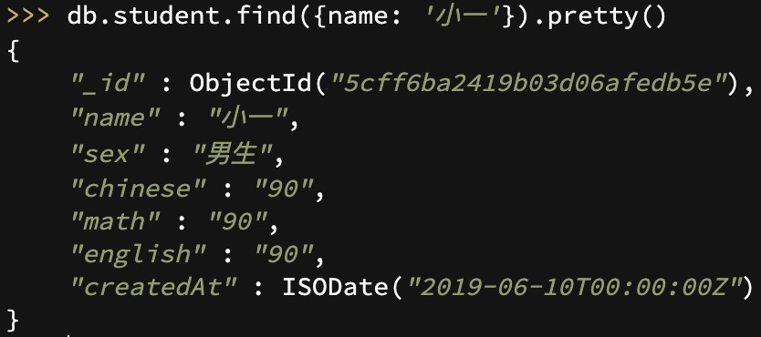

然后再查小二和小三的成绩。他突然发现小三是女装大佬的事实，震惊！
```javascript
// 查询方法：find
db.student.find({$or: [{name: '小二'}, {name: '小三'}]}).pretty()
```


> 其中 `$or` 是查询操作符，告诉 `mongo` 需要对符合的数据进行什么操作。用法差不多，列举部分如下（更多[查询操作符](https://docs.mongodb.com/manual/reference/operator/query/)）：
> 1. [$eq](https://docs.mongodb.com/manual/reference/operator/query/eq/#op._S_eq)：匹配等于指定值的值。
> 2. [$gt](https://docs.mongodb.com/manual/reference/operator/query/gt/#op._S_gt)：匹配大于指定值的值。
> 3. [$lt](https://docs.mongodb.com/manual/reference/operator/query/lt/#op._S_lt)：匹配小于指定值的值。
> 4. [$and](https://docs.mongodb.com/manual/reference/operator/query/lt/#op._S_lt)：列举条件都匹配。
> 5. [$not](https://docs.mongodb.com/manual/reference/operator/query/lt/#op._S_lt)：列举条件都不匹配。
> 6. [$or](https://docs.mongodb.com/manual/reference/operator/query/lt/#op._S_lt)：列举条件匹配其中一个。

## 7.删除
小一内心纠结，最后把这事告诉小三。小三觉得无颜面对同学和老师，决定退学。老师把小三的信息从教务系统删除。

```javascript
// 删除方法：deleteOne
db.student.deleteOne({name: '小三'})
```
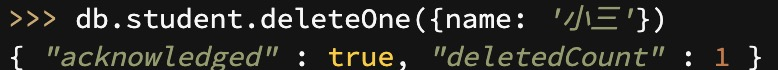

## 8.循环
期末老师做工作总结，发现成绩录入成字符串，应该是数字类型才对，所以操作循环更改。

```javascript
// 遍历方法：forEach
db.student.find().forEach(function(doc) {
  doc.chinese = NumberInt(doc.chinese);
  doc.math = NumberInt(doc.math);
  doc.english = NumberInt(doc.english);
  db.student.save(doc);
})
```

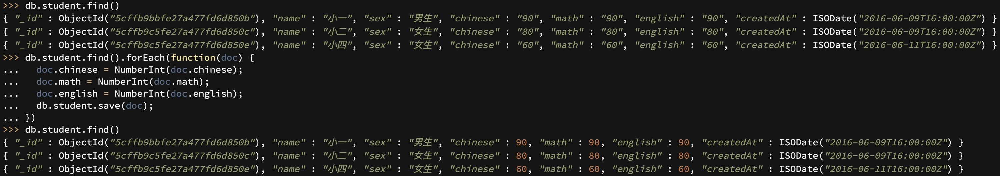

> 数字类型：`NumberInt`强制转化为数字类型。

## 9.聚合
期末老师需要把班级的语文、数学、英语的平均分计算出来。

### 9.1 aggregate
```javascript
// 聚合方法：aggregate
// 而$chinese、$math和$english只是代表文档字段。
db.student.aggregate([
  {
    $group: {
      _id: null,
      sumChinese: { $sum: '$chinese' },
      avgChinese: { $avg: '$chinese' },
      sumMath: { $sum: '$math' },
      avgMath: { $avg: '$math' },
      sumEnglish: { $sum: '$english' },
      avgEnglish: { $avg: '$english' },
    }
  }
]).pretty()
```

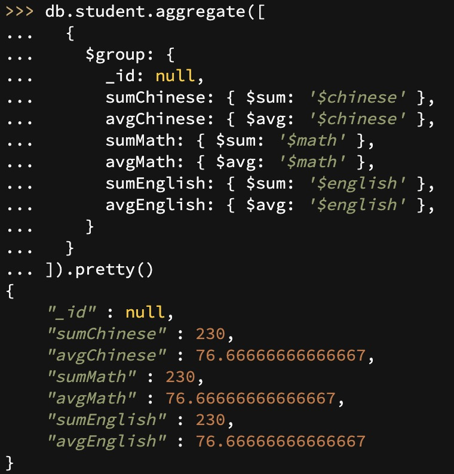

> `$group`是分组操作符，根据`_id`来进行分组，如果传`null`就是不分组，选择所有的数据。
> 其中 `$sum` 和 `$avg` 是聚合操作符，告诉 `mongo` 需要对符合的数据进行什么操作。用法差不多，列举部分如下（更多[聚合操作符](https://docs.mongodb.com/manual/reference/operator/aggregation/)）：
> 1. [$sum](https://docs.mongodb.com/v2.6/reference/operator/aggregation/sum/#grp._S_sum)：返回每个组的总和（忽略非数字值）；
> 2. [$avg](https://docs.mongodb.com/v2.6/reference/operator/aggregation/avg/#grp._S_avg)：返回每个组的平均值（忽略非数字值）；
> 3. [$max](https://docs.mongodb.com/v2.6/reference/operator/aggregation/max/#grp._S_max)：返回每个组的最高表达式值；
> 4. [$min](https://docs.mongodb.com/v2.6/reference/operator/aggregation/min/#grp._S_min)：返回每个组的最低表达式值；
> 5. [$gte](https://docs.mongodb.com/v2.6/reference/operator/aggregation/gte/#exp._S_gte)：如果给定的值大于等于，返回true，否则返回false；
> 6. [$lte](https://docs.mongodb.com/v2.6/reference/operator/aggregation/lte/#exp._S_lte)：如果给定的值小于等于，返回true，否则返回false；
> 7. [$add](https://docs.mongodb.com/v2.6/reference/operator/aggregation/add/#exp._S_add)：添加数字以返回总和，或添加数字和日期以返回新日期；
> 8. [$year](https://docs.mongodb.com/v2.6/reference/operator/aggregation/year/#exp._S_year)：以数字（例如2014）返回日期的年份；
> 9. [$month](https://docs.mongodb.com/v2.6/reference/operator/aggregation/month/#exp._S_month)：以1（1月）到12（12月）之间的数字返回日期的月份；
> 10. [$dayOfMonth](https://docs.mongodb.com/v2.6/reference/operator/aggregation/dayOfMonth/#exp._S_dayOfMonth)：以1到31之间的数字返回日期的月中某天。

老师发现上面的计算方式是计算所有的学生的成绩，而这次只需要计算2019年6月10号考试成绩，修改如下：
```javascript
db.student.aggregate([
  {
    $match: {
      createdAt: {
        $gte: new Date('2016-06-09T16:00:00Z'),
        $lte: new Date('2016-06-10T16:00:00Z')
      }
    },
  },
  {
    $project: {
      name: 1,
      sex: 1,
      chinese: 1,
      math: 1,
      english: 1,
      time: {$add: ['$createdAt', 8 * 60 * 60 * 1000]}
    }
  },
  {
    $group: {
      _id: {
        year: {'$year': '$time'},
        month: {'$month': '$time'},
        day: {'$dayOfMonth': '$time'},
      },
      sumChinese: { $sum: '$chinese' },
      avgChinese: { $avg: '$chinese' },
      sumMath: { $sum: '$math' },
      avgMath: { $avg: '$math' },
      sumEnglish: { $sum: '$english' },
      avgEnglish: { $avg: '$english' },
    }
  }
]).pretty()
```

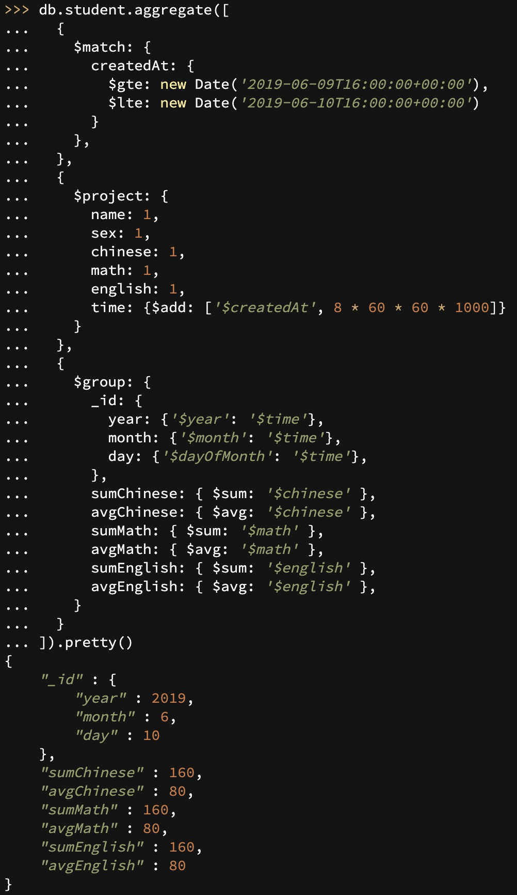

`time` 字段用来显示中国真实时间，它的值是 `createedAt` 的值再加8个小时。因为 `mongo` 默认存储世界标准时间，中国在东八区，需要加8个小时才能正确显示中国时间。
> 1. `$match` ：筛选操作符，顾名思义只有满足条件的数据才继续传递下去；
> 2. `$project` ：修改返回数据结构的操作符，1表示显示，不写或者0则不显示。（`aggregate` 聚合方法接受数组参数，因为有管道概念，简单说前面命令执行完的结果作为后面命令的参数，像`jquery`的点连接符。）

### 9.2 MapReduce
除了使用聚合方法，还可以使用 `MapReduce` 方法来计算。
> `Map-Reduce` 是一种计算模型，简单的说就是将大批量的工作（数据）分解（MAP）执行，然后再将结果合并成最终结果（REDUCE）。MongoDB提供的Map-Reduce非常灵活，对于大规模数据分析也相当实用。

```javascript
db.student.mapReduce(
  function(){
    emit(null, this);
  }, 
  function(key, values){
    var reducedVal = {
      sumChinese: 0,
      avgChinese: 0,
      sumMath: 0,
      avgMath: 0,
      sumEnglish: 0,
      avgEnglish: 0
    };
    
    for (var i = 0; i < values.length; i++) {
      reducedVal.sumChinese += values[i].chinese;
      reducedVal.sumMath += values[i].math;
      reducedVal.sumEnglish += values[i].english;
    }
    
    reducedVal.avgChinese = reducedVal.sumChinese / values.length;
    reducedVal.avgMath = reducedVal.sumMath / values.length;
    reducedVal.avgEnglish = reducedVal.sumEnglish / values.length;
    
    return reducedVal;
  }, 
  {
    query: {createdAt: {$gte: new Date('2016-06-09T16:00:00Z'), $lte: new Date('2016-06-10T16:00:00Z')}}, 
    out: 'sum'
  }
).find().pretty()
```
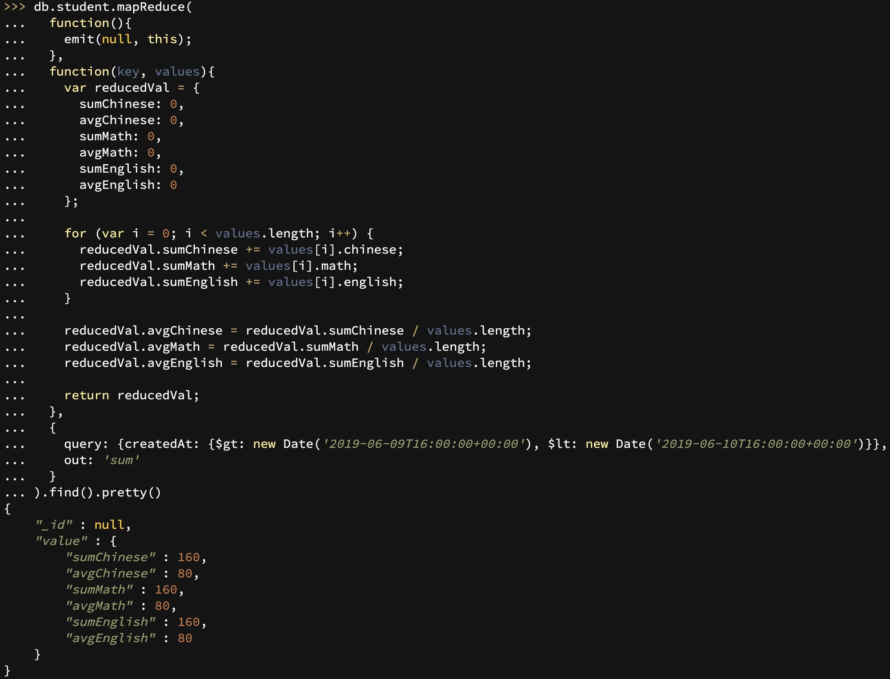
上面 `mongo` 语句的意思是：
1. 根据 `query` 筛选出合适的数据（相当于聚合 `aggregate` 的 `$match` ），交给 `map` 函数（`mapReduce`接受的第一个参数）；
2. `map` 函数调用 `emit` 函数遍历所有筛选数据，传递的第一个参数表示分组，我们不需要分组就传递 `null`，第二个参数是对应的数据，我们把完整数据传递下去给给 `reduce` 函数（`mapReduce`接受的第二个参数）；
3. `reduce` 函数接收 `map` 传递的 `key` 和 `values` 值（就是对应上面的 `emit(null, this)`），我们只需要按自己的需求遍历组装，返回组装好的数据就可以了。

## 10.总结
`mongo` 很好玩，本篇文章只是记录功能开发中运用 `mongo`的一些场景，而且 `mongo` 的内容远远不止本篇文章写的这么一点点范围，有兴趣可以查阅[官方文档](https://docs.mongodb.com/manual/tutorial/getting-started/)。
